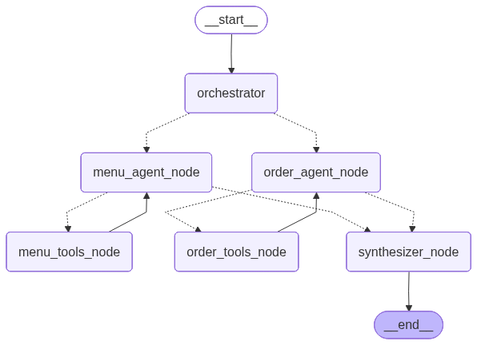

# Multi-agent Order Assistant

This repository contains structured datasets and foundational logic for a **multi-agent food ordering assistant**. It includes detailed menu and order data models that can be used for AI-driven restaurant automation, order tracking, and recommendation systems.

---

## 📁 Project Structure

```
src/
 ├── main.py             # Entry point for the multi-agent system
 ├── config.py           # Configuration and environment setup
 ├── state.py            # Shared state management between agents
 ├── graph.py            # Graph-based orchestration logic
 ├── logger.py           # Logging utilities
 │
 ├── agents/             # Core AI agents
 │   ├── menu_agent.py       # Handles menu-related queries
 │   ├── order_agent.py      # Handles order management
 │   ├── orchestrator.py     # Coordinates multi-agent interactions
 │   ├── synthesizer.py      # Synthesizes responses from multiple agents
 │   └── prompts.py          # Prompt templates for LLM interactions
 │
 ├── data/               # Static datasets
 │   ├── menu.py             # Original menu catalog
 │   ├── orders.py           # Original order database and policies
 │
 ├── tools/              # Utility modules for data and retrieval
 │   ├── menu_tools.py       # Menu data utilities
 │   ├── order_tools.py      # Order data utilities
 │   └── rag.py              # Retrieval-Augmented Generation utilities
 │
 └── voice/              # Voice interaction modules
     ├── recorder.py         # Handles voice input
     └── speaker.py          # Handles voice output
```

---

## 🧩 System Overview

The following diagram illustrates the high-level architecture of the **Multi-agent Order Assistant**:



---

## 🍕 Menu Catalogs

### `menu.py`
Contains the base `MENU_CATALOG` with a variety of dishes across cuisines:
- Italian (Pizza, Pasta)
- Indian (Curry, Starters, Drinks)
- American (Burgers)
- Fusion (Bowls)

Each menu item includes:
- `id`: Unique dish identifier
- `name`: Dish name
- `category`: Type of dish (e.g., Pizza, Pasta, Drink)
- `cuisine`: Cuisine type
- `price`: Price in INR
- `rating`: Average customer rating
- `dietary_tags`: Dietary information (e.g., vegan, gluten-free)
- `description`: Short description of the dish
- `available`: Availability status

### `menu.py`
An extended version of the menu with more popular and globally recognized dishes:
- Pepperoni Pizza, Chicken Alfredo Pasta, Tandoori Chicken, Falafel Wrap, BBQ Bacon Burger, Caesar Salad, Pad Thai, Avocado Toast, Chocolate Brownie, Iced Coffee

This dataset expands the cuisine diversity to include **Middle Eastern**, **Thai**, and **Breakfast/Fusion** options.

---

## 🧾 Order Databases

### `orders.py`
Defines the base `ORDER_DATABASE` with sample orders linked to dishes from `menu.py`. Each order includes:
- `item_id` and `item_name`
- `customer_name` and `customer_email`
- `status`: (Placed, Preparing, Out for Delivery, Delivered)
- `price`, `order_date`, `estimated_delivery`, and `tracking_id`

Also includes `DELIVERY_POLICIES` outlining:
- Delivery options (Express, Standard, Scheduled)
- Cancellation and refund rules
- Escalation and support response times


---

## ⚙️ Usage

These datasets can be used for:
- **AI/ML training** for order prediction, recommendation, or chatbot systems
- **Backend simulation** for restaurant management systems
- **Testing** of order tracking and refund logic

Example usage:

```python
from src.data.menu import MENU_CATALOG
from src.data.orders import ORDER_DATABASE

# Access a menu item
print(MENU_CATALOG[0]["name"])

# Retrieve an order
order = ORDER_DATABASE["ORD-301"]
print(order["status"])
```

---

## 🧠 Future Enhancements
- Integration with a **multi-agent system** for automated order handling
- Dynamic pricing and availability updates
- Real-time delivery tracking simulation
- Customer feedback and sentiment analysis integration

---

## 👨‍💻 Author
Developed as part of the **Agentic AI Multi-agent Order Assistant** project.

---

## 📜 License
This project is open-source and available under the MIT License.
